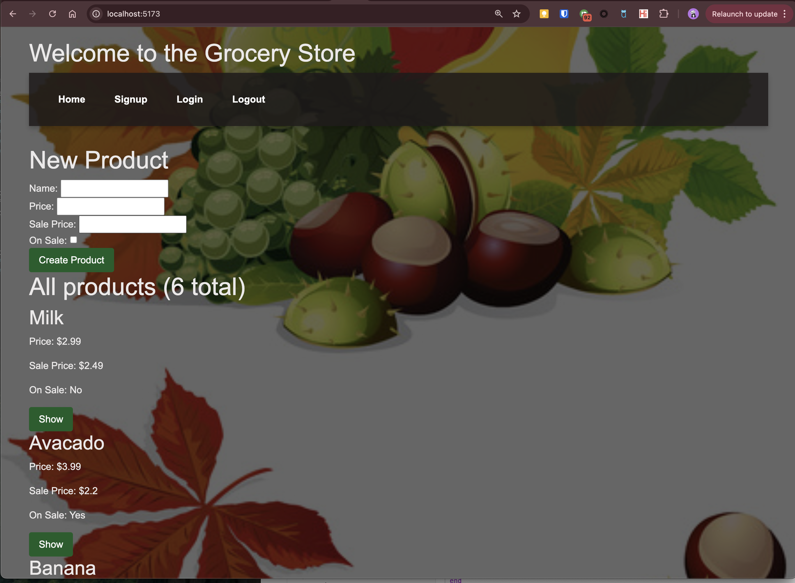
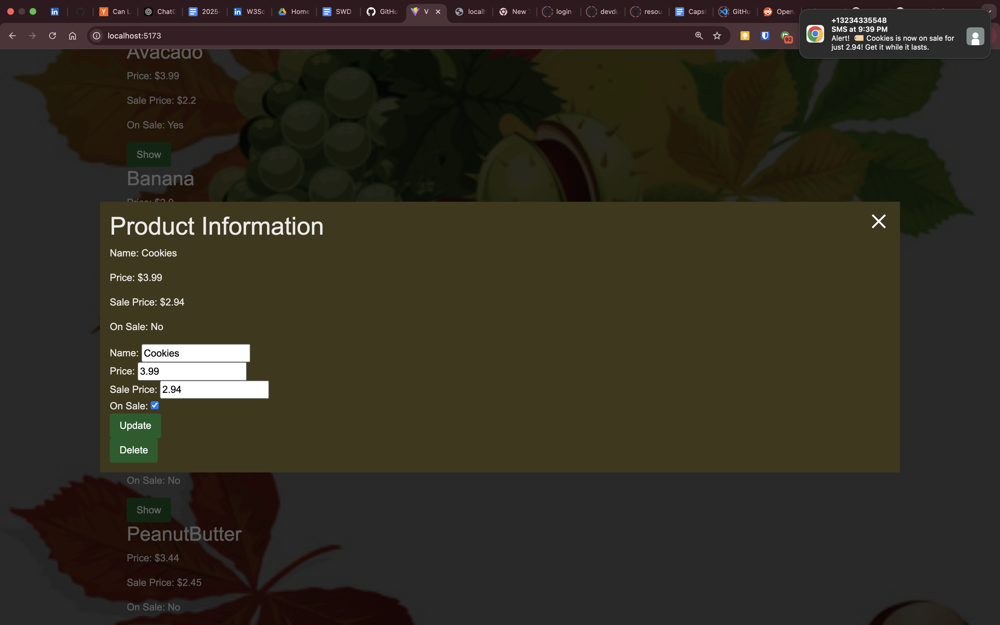

# React + Vite

# SmS Enhanced Grocery Store

## Description

Welcome to the SMS Enhanced Grocery Platform GitHub repository! This platform melds the utility of an e-commerce grocery store with the dynamic interaction of SMS notifications, facilitated by Twilio's powerful communication APIs. Designed for grocery store owners and consumers alike, this application focuses on real-time engagement by notifying customers about product sales and promotions directly through SMS.



## Features

- **User Authentication:** Provides secure login, logout, and signup features to manage user sessions and protect user data.
- **Product Management:** Allows administrative users to add, update, and display products with essential details such as name, regular price, and discounted sale price.
- **Twilio(API) Real-time SMS Notifications:** Integrates with Twilio to send out SMS alerts when products are listed as on sale, ensuring customers receive timely updates on discounts and special offers.
- **Responsive Design:** Crafted to provide a seamless experience on various devices, making shopping accessible and straightforward from anywhere.

## Technologies Used

- **Frontend:** React,HTML, CSS, and JavaScript for crafting a user-friendly interface.
- **Backend:** Ruby on Rails for handling server-side logic, including API integration and database operations.
- **Database:** PostgreSQL

Images are here:

- https://github.com/mkanwal-iit/grocery-store-frontend-react/tree/main/images

## Project Structure

### Source Directory

- **src/**: Contains all the source code for the application.

#### CSS Files

- **App.css**: Global styles for the application.
- **index.css**: Additional global styles.

#### JavaScript/JSX Files

- **App.jsx**: The main application component. Sets up routing and includes the header and footer.
- **Footer.jsx**: The footer component.
- **Header.jsx**: The header component, which includes navigation links.
- **LoginPage.jsx**: The login page component.
- **LogoutLink.jsx**: A component that handles user logout.
- **main.jsx**: The entry point for the React application. Renders the `App` component.
- **ProductsIndex.jsx**: A component that lists all products.
- **ProductsIndexPage.jsx**: A page component that uses `ProductsIndex`.
- **ProductsNew.jsx**: A component for creating a new product.
- **ProductsNewPage.jsx**: A page component that uses `ProductsNew`.
- **ProductsPage.jsx**: A page component that handles product-related actions like create, update, delete, and show.
- **ProductsShow.jsx**: A component that shows detailed information about a product.
- **SignupPage.jsx**: The signup page component.

### Configuration Files

- **vite.config.js**: Configuration file for Vite.

## Getting Started

### Prerequisites

- Node.js
- npm

### Installation

1. Clone the repository:

   ```sh
   git clone https://github.com/mkanwal-iit/grocery-store-frontend-react.git

   ```

2. Navigate to the project directory:
   ```sh
   cd grocery-store-frontend-react
   ```
3. Install dependencies:
   ```sh
   npm install
   ```

### Running the Project

To start the development server, run:

```sh
npm run dev
```

To build the project for production, run:

```sh
npm run build
```

To preview the production build, run:

```sh
npm run preview
```

you can clone backend on ruby on rails using this link

```sh
 git clone  https://github.com/mkanwal-iit/grocery_store_app.git
```

2. Navigate to the project directory:
   ```sh
   cd grocery_store_app
   ```
3. Install dependencies:
   ```sh
   bundle install
   ```
4. To start the development server, run:

```sh
rails server
```
